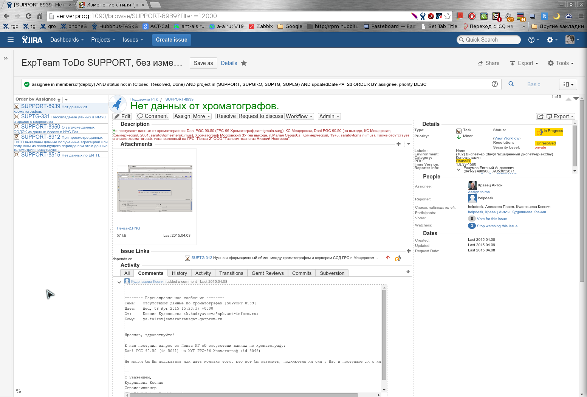

# jira-compact.user.css
Css styles to compact jira (>=6.1) representation. For example to use with Stylish Chromium and Firefox extension

Any feedback welcome!

## How to use
For Chrome/Chromium browswers I use it in nice [Stylish](https://chrome.google.com/webstore/detail/stylish/fjnbnpbmkenffdnngjfgmeleoegfcffe?hl=ru) extension.
I have not tested, but should work in [Firefox Stylish](https://addons.mozilla.org/ru/firefox/addon/stylish/) variant too (please let me known if it is not true).

Installation should be easy: Just hit button "Create style" and copy/paste content of file https://raw.githubusercontent.com/Hubbitus/jira-compact.user.css/master/jira-compact.user.css.
Unfortunately I do not known if there present auto installation or check to updates (so, just return from time to time to changes).

## What it is

I use Jira in my day job. It very good famous and extensible bug tracker. But even I use wide monitor additionally to notebook their design seems to me very sprawling.

That style was born several month when I tried there and there reduce elements and spaces beetween, move description right, highlight title and key fields like status…

As it style 100 words have worth less than example looks (for simplicity and easy distinguishing I will show screenshots of original Jira in Firefox and in Chromium with that style applied)

### Screenshots

1) Jira 3 column dashboard (aaa layout):

Please note - **even more rows and columns in widgets tables - scrolling dissapeared**.

2) Jira 2 column dashboard (ba layout):

*Unfortunately there one implementation details quirk: Widgets at right must be at colors 5 (blue - #003366), 6(violet - #3C78B5) or 7 (grey - #bbbbbb). Otherwise you may just change style*.

3) Issues and its list (search, filter).

You may see several enhansments here:
* Issue details from center moved to right. So, yuo start read from problem, meta information also at top right.
* Left list do not truncate issue summary at half of word - instead multiline used.
* If you use [Threaded comments plugin](https://marketplace.atlassian.com/plugins/com.atlassian.jira.threadedcomments.threaded-comments) there are also few changes - compactnes, highlight odd lines and fir like/dislike bug appearence as a bonus.

## Licensing
Work distributed under terms of [CC BY - Creative Commons Attribution](http://creativecommons.org/licenses/by/4.0/)
