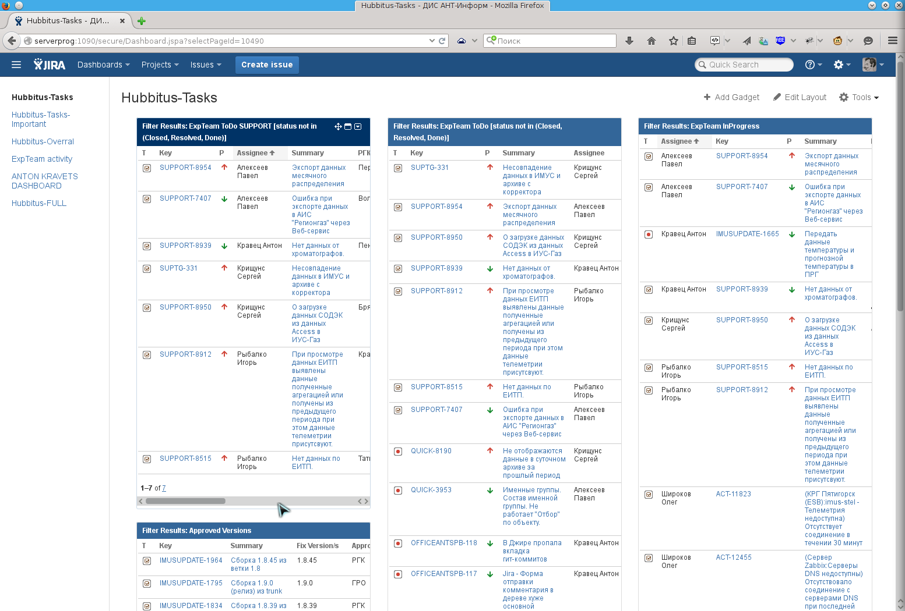
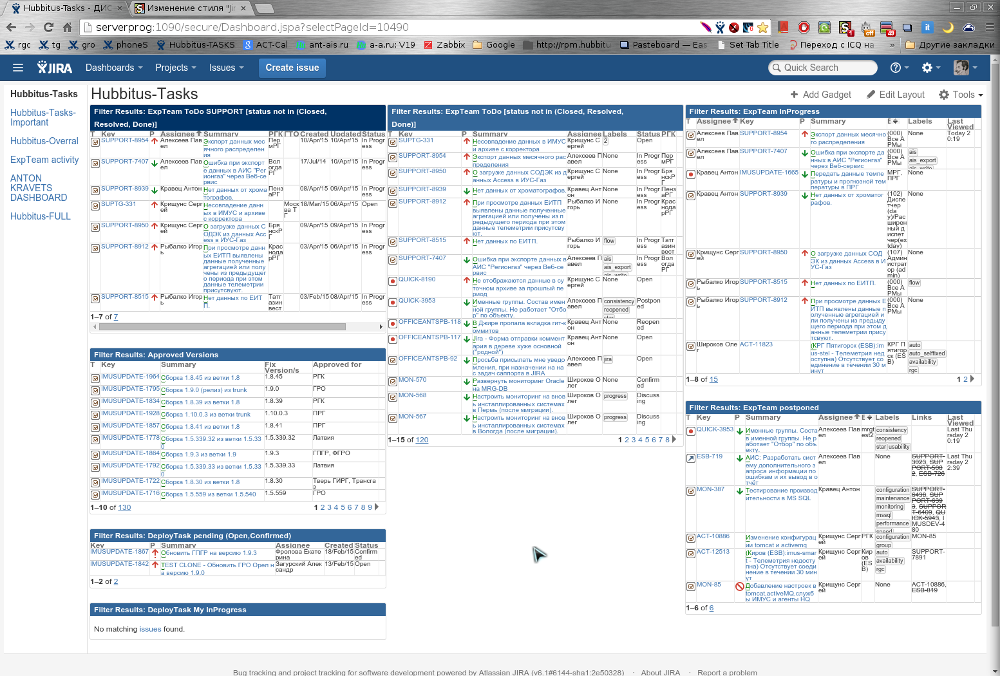
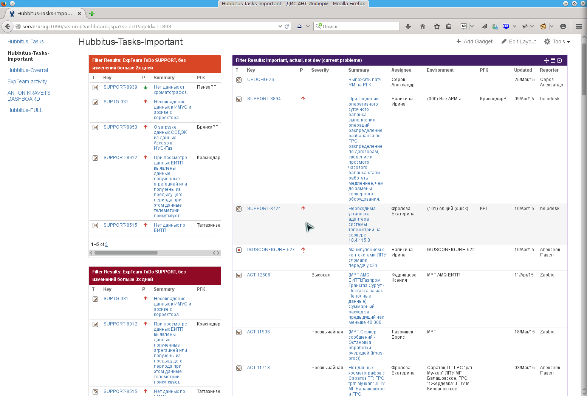
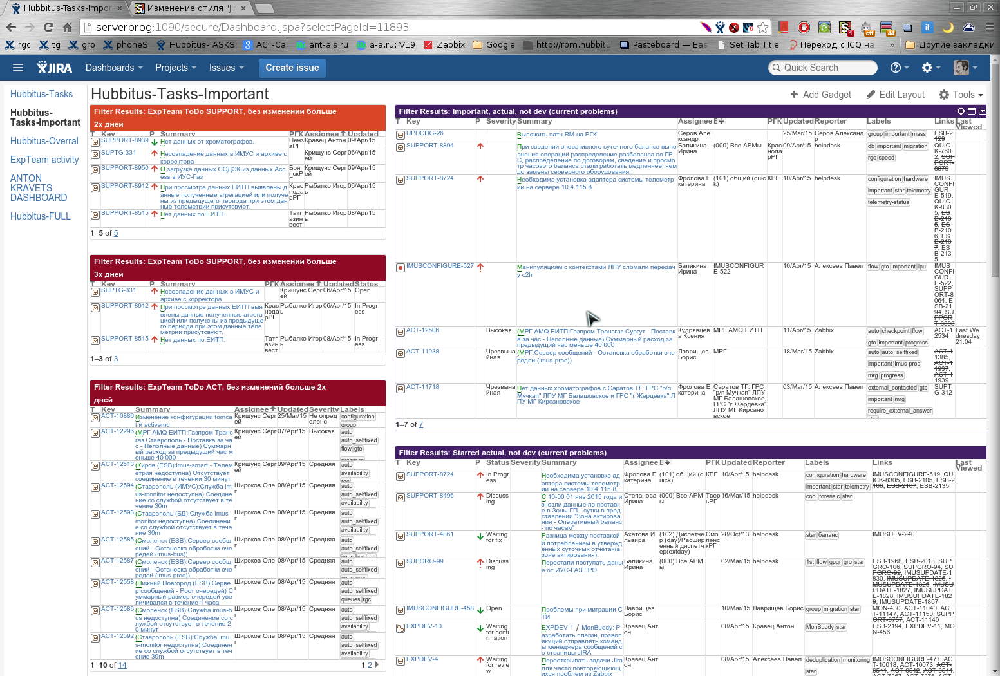
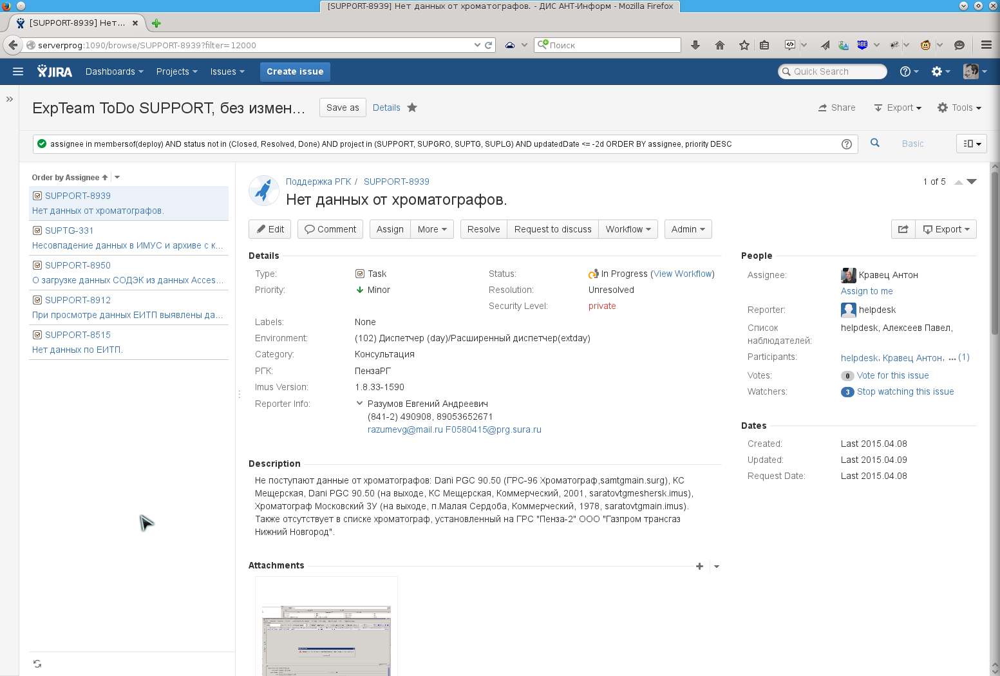
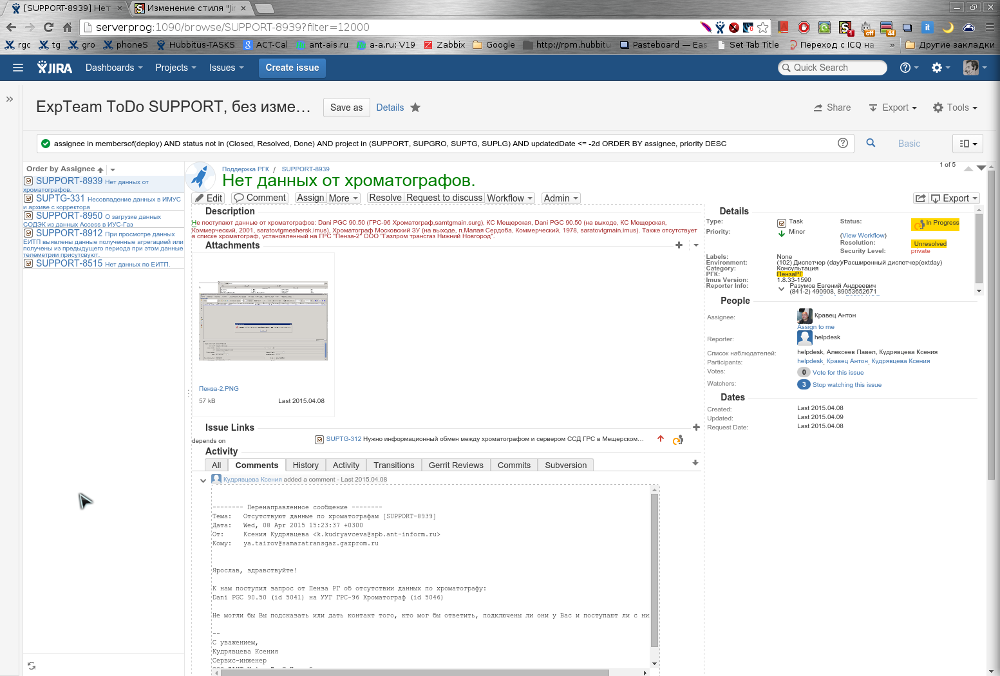
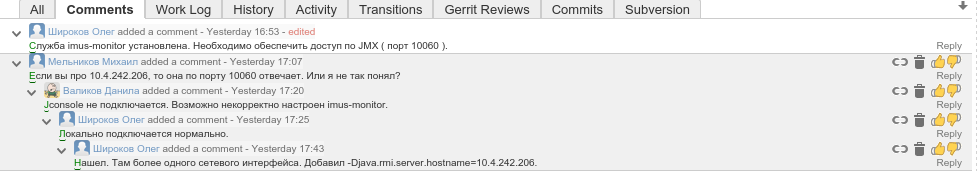

# jira-compact.user.css
Css styles to compact jira (>=6.1) representation (now support up to version 8.1). For example to use with Stylish Chromium and Firefox extension

Any feedback welcome!

## How to use
For Chrome/Chromium browswers I use it in nice [Stylish](https://chrome.google.com/webstore/detail/stylish/fjnbnpbmkenffdnngjfgmeleoegfcffe?hl=ru) extension.
I have not tested, but should work in [Firefox Stylish](https://addons.mozilla.org/ru/firefox/addon/stylish/) variant too (please let me known if it is not true).

You may install it from Stylish site: https://userstyles.org/styles/112544/jira-6-1-compact-theme in that case updates will be propogated automatically.

Alternatively: Just click button "Create style" and copy/paste content of file https://raw.githubusercontent.com/Hubbitus/jira-compact.user.css/master/jira-compact.user.css.

## What it is

I use Jira in my day job. It very good famous and extensible bug tracker. But even I use wide monitor additionally to notebook their design seems to me very sprawling.

That style was born several month when I tried there and there reduce elements and spaces between, move description right, highlight title and key fields like status…

As it style 100 words have worth less than example looks (for simplicity and easy distinguishing I will show screenshots of original Jira in Firefox and in Chromium with that style applied)

### Screenshots

1) Jira 3 column dashboard (aaa layout):

Please note - **even more rows and columns in widgets tables - scrolling dissapeared**.

2) Jira 2 column dashboard (ba layout):

*Unfortunately there one implementation details quirk: Widgets at right must be at colors 5 (blue - #003366), 6(violet - #3C78B5) or 7 (grey - #bbbbbb). Otherwise you may just change style*.

3) Issues and its list (search, filter).

You may see several enhancments here:
* Issue details from center moved to right. So, you start read from problem, meta information also at top right.
* Left list do not truncate issue summary at half of word - instead multiline used.
* If you use [Threaded comments plugin](https://marketplace.atlassian.com/plugins/com.atlassian.jira.threadedcomments.threaded-comments) there are also few changes - compactnesss, highlight odd lines and fir like/dislike bug appearence as a bonus.

## Licensing
Work distributed under terms of [CC BY - Creative Commons Attribution](http://creativecommons.org/licenses/by/4.0/)

## Changelog
* 2024-06-27 Fix list styling on widgets add list
* 2024-06-27 Style 3 types of dashbord layouts. Fix left tabs menu on dashboards. Cleanup.
* 2024-01-12 Updates for JIRA 9.12 - fix issue blocks titles visibility with icons
* 2023-12-26 Support JIRA 9.4 in board - add title in cards visualization
* 2023-10-20 Format blockquote in comments
* 2023-09-20 Format panel inside structure table
* 2023-05-18 Fix borders and headers in structure table
* 2023-03-26 Fix textarea folding icon appearance (was hidden)
* 2023-03-19 Fix structure dragging rows paddings.
* 2023-02-17 Decrease height of structure header
* 2023-01-28 Special highlight custom field "Block reason"
* 2023-01-26 Add avanced roadmap styling, re-made style of structure table
* 2022-04-20 In EPIC issues list decrease resolution icon
* 2022-04-05 Fix issues table list actions buton appearance (by hover)
* 2022-01-11 Board more compact - decrease font, board headers join two lines.
* 2021-12-27 Style kanban board header and sub-tasks - show full task name, reduce spaces
* 2021-12-26:
  - Made board issue titles smaller (x-small).
  - Disable brawn color for the task descriptions.
* 2021-12-13 Fix margin for the assignee field in the structure table
* 2021-12-02 Style issue header with shadow. Fix dashboard isseu sidebar details overlay
* 2021-11-15 Fix main header dropdown menu icons heigh
* 2021-11-08 Fix kanban board quick filters style new Jira 8.19.1
* 2021-11-07 Fix visual editor width for new Jira 8.19.1
* 2021-07-26 Decrease board column gaps
* 2020-10-29 In structure highlight grouping rows
* 2020-10-26 Fix structure plugin table row control dissapearance. More compact card in board by "Spent in status"
* 2020-10-20 Add Structure plugin table compact styling.
* 2020-09-16 Set backround color for blockquote
* 2020-09-15 Fix buttons height. Exclude font "Droid Sans" because it looks ugly.
* 2020-09-11 For fresh JIRA fixes:
  - Compact left issues list in filter.
  - Fix project administration page headers
  - Issue "details" header move right to details itself.
* 2020-03-06 Fix Kanban board avatar placement for very short tasks summary (with little height of card)
* 2020-03-04 Compact issue tables Status and Epic columns, fix list artifacts in top-right corner menu (like "Help", "Administration")
* 2020-03-02 Compact Kanban board
* 2020-02-14 Compact tables in dashboard widgets
* 2019-11-15 Fix issues list in Epic: Fix width of status and percentage column.
* 2019-11-05 Add styling of "Two dimensional filter statistic" gadget
* 2019-05-08 Styling dashboards left list and widgets spacing. Do not indent 
 in dashboards. Support Jira 8.1.
* 2019-03-11 Fix epic linked tasks table glitch
* 2019-02-03 Fix status labels break on epic issues list
* 2018-12-22 Show linked issues full list always with scrolling in blocks
* 2018-11-01 Do not wrap assignee in epic tasks list
* 2018-01-26 Change applying regexp for all domains starting from "jira."
* 2018-01-19 Firefox compatability fix for gadgets
  - Drop line-height: 1.4em; for p::first-letter
  - For gadgets table allign header by center and all cells by middle vertically.
* 2017-10-18 Allow break long task statuses by full words like "Selected for development"
* 2017-06-14 Add support of custom text-fields in issue
* 2017-03-04 Fix main task description edit with issue
* 2017-02-27 Decrease labels padding for dashboards, smaller issue-list action button, fix issues sub-list line doubling due to the icons
* 2017-02-17 Fix scrolling and tune some other styles like icons in issues search left navigation list
* 2017-02-17 Compact also Epic issues list in issue
* 2017-02-17 Fix height of buttons and menus on issue like "edit", "comment", "assign"…
* 2017-02-09 Issues sub-list correct percentage column style
* 2017-02-01 Fix linked issues sub-list always full
* 2017-01-24 Compact dates in dashboards widgets
* 2017-01-16 Fix row ordering arrows in one line in sub-tasks list. Compact (v) sign on completed sub-tasks
* 2016-07-26 Show linked issues full list
* 2016-07-21 Compact style also pie-chart on dashboard
* 2016-07-12 Fix issue with time spent/remaining bars in sub-tasks
* 2016-07-12 In sub-tasks task list arrows for reordering place in one line to decrease height
* 2016-07-11 Allow wrap labels in td
* 2016-07-04 Update to fresh Jira styling of dashboards.
* 2016-06-02 Format editable fields and icons
* 2016-05-31 Fix sub-tasks list and editing area.
* 2016-04-15 Fix line height (introduced by previous font size change). Add terms (code, kbd, tt) highlight.
* 2016-04-14 Change main font to slightly large (x-small -> small) to normal distinguish bold. Fix editable for Jira version 6.4.11
